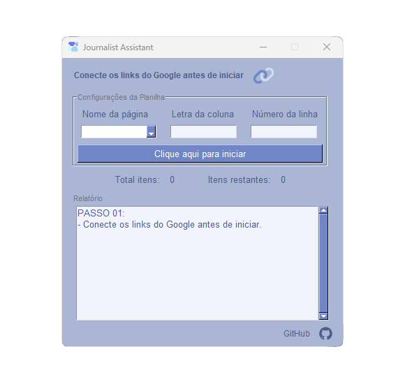
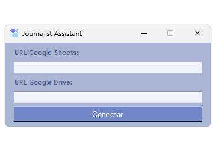
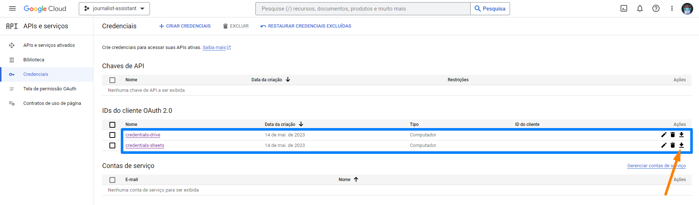

# Journalist Assistant - Automatização do Google Sheets e do Google Drive

> Este repositório está atualmente disponibilizado de forma pública para fins de estudo. Sinta-se à vontade para fazer o download, criar sua cópia ou clonar o repositório para explorar o seu conteúdo.

Automatize e agilize o processo de extração e preenchimento de dados com a aplicação <b>Journalist Assistant</b>, uma ferramenta eficaz para jornalistas e profissionais da comunicação.

## Características Principais

- **Automação de Extração:** Elimine a tarefa repetitiva de buscar links no Google Drive e preencher planilhas no Google Sheets. Com o <b>Journalist Assistant</b>, insira os links uma vez e deixe o software extrair informações automaticamente.
- **Interface Intuitiva:** A interface de usuário moderna e intuitiva do <b>Journalist Assistant</b> torna o processo de extração e preenchimento simples e eficiente.
- **Autenticação e Tokens:** Utilize a autenticação do Google para acessar o Google Drive e o Google Sheets. O software gerencia os tokens de acesso para você.
- **Automatização de Preenchimento:** Os links fornecidos são usados para buscar nomes de páginas e conteúdo no Google Sheets, além de acessar o conteúdo no Google Drive e criar links clicáveis nas planilhas correspondentes.

## Status do Projeto

O <b>Journalist Assistant</b> está finalizado e em uso ativo.

### GIF Demonstrativo


### Capturas de Tela

##### ❇ UI (2 telas)

| Hub Principal | Tela de Conexão                                          | 
|-|----------------------------------------------------------|
|  |  | 

## Configuração das Credenciais do Google

Antes de usar o <b>Journalist Assistant</b>, siga estas etapas para configurar as credenciais de acesso:

1. Acesse o [Google Cloud Console](https://console.cloud.google.com/).
2. Crie um novo projeto.
3. Ative as APIs do Google Sheets e do Google Drive para o seu projeto.
4. Crie credenciais OAuth 2.0 para o tipo "Aplicativo para Computador". Isso fornecerá o ID do Cliente OAuth necessário para a autenticação.
5. Baixe os arquivos JSON com as credenciais de cada API
6. Coloque-os na pasta raiz do projeto com os nomes `credentials-drive.json` e `credentials-sheets.json`, respectivamente.



## Instalação e Uso

Para utilizar o <b>Journalist Assistant</b>, certifique-se de que você tenha o Python 3.11.3 ou superior instalado em sua máquina. Em seguida, siga as instruções abaixo:

1. Clone este repositório:
   ```
   git clone https://github.com/GustavoRosas-Dev/journalist-assistant.git
   ```
2. Navegue até o diretório do projeto:
   ```
   cd journalist-assistant
   ```
3. Instale as dependências:
   ```
   pip install -r requeriments.txt
   ```

4. Execute o software:
   ```
   python main.py
   ```

5. O aplicativo abrirá uma interface onde você deve inserir os links do Google Drive e do Google Sheets. Após a autenticação bem-sucedida, os tokens de acesso serão fornecidos na pasta raiz do projeto.

Certifique-se de manter os tokens de acesso seguros e não compartilhá-los.

---

**Observação Adicional:**

Após a autenticação, no hub principal do aplicativo, você poderá escolher qual página do Google Sheets deseja automatizar, selecionar o número da coluna e da linha desejados e clicar em "Iniciar". O software executará suas tarefas até concluir todos os itens daquela coluna específica da planilha do Google Sheets.

## Contribuições

Contribuições são bem-vindas! Se você deseja contribuir para o aprimoramento do <b>Journalist Assistant</b>, siga estas etapas:

1. Faça um fork deste repositório.
2. Crie um novo branch para a sua funcionalidade:
   ```
   git checkout -b feature/nova-funcionalidade
   ```
3. Faça as alterações necessárias e teste-as.
4. Faça o commit das suas alterações:
   ```
   git commit -m "Adicionada nova funcionalidade"
   ```
5. Envie para o seu repositório fork:
   ```
   git push origin feature/nova-funcionalidade
   ```
6. Abra um `Pull Request` no repositório original.

## Licença

Este projeto é distribuído sob a Licença MIT. Consulte o arquivo `LICENSE` para obter mais detalhes.

## Nota

O <b>Journalist Assistant</b> é uma ferramenta útil para simplificar o processo de extração e preenchimento de dados para jornalistas e profissionais da comunicação.

---

Feito com um bule de ☕ por [Gustavo Rosas](https://github.com/GustavoRosas-Dev).
